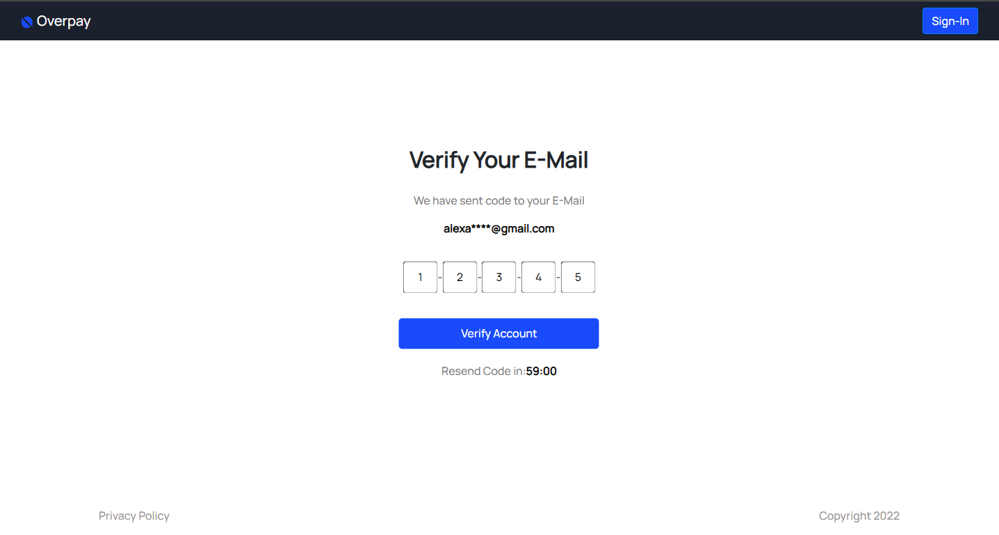

# Landing Page
---
### Tools Used
* HTML/CSS
* ReactJS

## Prerequisites

- Node.js 6.9.1+


### Run the Sample Application 
		
1. Open the terminal and navigate to your project folder.

``` bash
cd path/to/project
```

2. Use `npm` to install the dependencies:

``` bash
# install dependency
npm install
```

3. Build and run the project:

Use `npm run start` for a local build. View the application in your browser with the URL `http://localhost:3000`


```bash
# serve with hot reload at localhost:3000
npm run start
```


## Preview 
---
### Sign-In Page

### Sign-Up Page

---
### OTP Page

### Verification Page

### Profile Page


